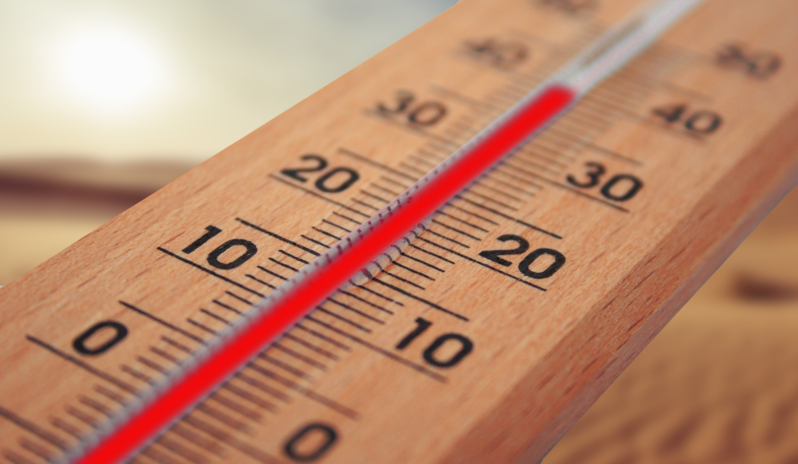

# Evans Thermometer

Cover image was originally copied from [https://pixabay.com/photos/thermometer-summer-heiss-heat-sun-4294021/](https://pixabay.com/photos/thermometer-summer-heiss-heat-sun-4294021/).

This is a fun project I did to track the temperature in my old office. I used a Raspberry Pi, Python, React, and Recharts to gather some temperature information and do some data visualization.

This repo also goes with my companion blog post [Temperature Sampling with a Raspberry Pi, Python, React, and Recharts]().

I also deployed this project on Netlify at [deployed]();

Here's a guide to the folders:

- `line-chart` = the frontend application that uses React and [Recharts](https://recharts.org/en-US/)
- `temperature-programs` = the Python programs that I used with a DHT22 sensor to take the temperature readings from inside my office
- `total-results` = the Python and files that I parsed to get the data for the "total" page on my frontend application
- `single-results` = the Python and files that I parsed to get the data for the "single" page on my frontend application
- `original_history_daily.log` = the original logfile that was all of my readings of temperature and humidity for the 2 weeks I did this experiment

# Additional Notes

- for the frontend I had to downgrade to React 16, see the GitHub issue athttps://github.com/recharts/recharts/issues/2368
- The line chart setup for my components I originally copied from the Recharts examples at https://codesandbox.io/s/simple-line-chart-kec3v
